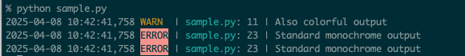

[](https://github.com/takatosh/logkiss)

# LOGKISS
LOGKISS (Keep It Simple and Stupid Logger) is a user-friendly logging library for Python.
Built on top of the standard logging module, it provides an interface with sensible defaults out of the box.

## Features

- **Colorful by Default**: LOGKISS uses `KissConsoleHandler` by default, which outputs logs in different colors based on log levels.
- **Drop-in Replacement**: Use it as a drop-in replacement for the standard `logging` module with `import logkiss as logging`.
- **Flexible Switching**: Easily switch back to the standard `ConsoleHandler` when needed.


## Innovations

- Aggregate log volume statistics per logger
- Guided configuration for logger-level suppression
- Handler sharing capabilities
- Console UI


## Installation

```bash
pip install logkiss
```

## Usage

```python
# 1. Using KissConsoleHandler by default:
import logkiss

logger1 = logkiss.getLogger("example1")
logger1.info("Colorful output")

# 2. Using as a logging module replacement:
import logkiss as logging

logger2 = logging.getLogger("example2")
logger2.warning("Also colorful output")

# 3. Switching to standard ConsoleHandler:
import logging

logger3 = logging.getLogger("example3")
handler = logging.StreamHandler()
handler.setFormatter(logging.Formatter(
    fmt='%(asctime)s,%(msecs)03d %(levelname)-5s | %(filename)s:%(lineno)3d | %(message)s',
    datefmt='%Y-%m-%d %H:%M:%S'
))
logger3.addHandler(handler)
logger3.error("Standard monochrome output")
```




## Environment Variables

LOGKISS can be configured using the following environment variables:

- `LOGKISS_DEBUG`: Enable debug mode by setting to `1`, `true`, or `yes`. When enabled:
  - Root logger's level is set to `DEBUG` instead of `INFO`
  - More detailed logging information is displayed
- `LOGKISS_DISABLE_COLOR`: Disable colored output by setting to `1`, `true`, or `yes`
- `NO_COLOR`: Industry standard environment variable to disable colors (any value)

Example:
```bash
# Enable debug mode
export LOGKISS_DEBUG=1

# Run your Python script
python your_script.py
```

## Configuration

For detailed configuration options, please refer to [CONFIG.md](CONFIG.md).

## Acknowledgments

The output format of logkiss is inspired by [deigan / loguru](https://github.com/Delgan/loguru)

## License

This project is licensed under the MIT License - see the [LICENSE](LICENSE) file for details.

## Other Languages

- [日本語](README_JAPANESE.md)
