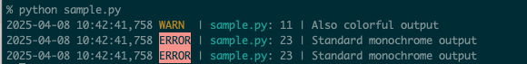

[](https://github.com/tkykszk/logkiss/actions/workflows/test.yml) [](https://www.python.org/) [](https://opensource.org/licenses/MIT) [](https://codecov.io/gh/tkykszk/logkiss)

LOGKISS (Keep It Simple and Stupid Logger) は、Python向けの使いやすいロギングライブラリです。
標準のloggingモジュールを活かしつつ、デフォルト設定をすることにより毎回設定を書くことなく使用できます。

## 特徴

- **デフォルトでカラフル**: LOGKISSは、デフォルトで`KissConsoleHandler`を使用し、ログレベルに応じて異なる色で出力します。
- **標準ロギングモジュールの代替**: `import logkiss as logging`とすることで、標準の`logging`モジュールの代わりとして使用できます。
- **柔軟な切り替え**: 必要に応じて、通常の`ConsoleHandler`に切り替えることができます。

## インストール

```bash
pip install logkiss
```

## 使い方

### 最小例（標準logging・logkiss互換）

```python
import logging
logging.warning("省略メソッドの最小例")
```

logkissでも同じ書き方で動作します:

```python
import logkiss as logging
logging.warning("初学者を惑わせがちな省略メソッド")
```

### 1. カラフルなコンソールロギング

最小限の設定で美しいカラー出力を得るために、LOGKISSを直接使用します：

```python
import logkiss

logger = logkiss.getLogger("example1")
logger.warning("ターミナルにカラフルな出力")
```

出力結果：
```
2025-04-12 08:06:23,215 WARN  | example.py:4   | ターミナルにカラフルな出力
```

### 2. loggingモジュールの代替として使用

```python
import logkiss as logging

logger2 = logging.getLogger("example2")
logger2.warning("カラフルな警告メッセージ")
logger2.error("カラフルなエラーメッセージ")
```

出力結果：
```
2025-04-12 08:06:45,117 WARN  | example.py:4   | カラフルな警告メッセージ
2025-04-12 08:06:45,119 ERROR | example.py:5   | カラフルなエラーメッセージ
```

  

### 3. カスタムハンドラー設定の使用

```python
import logging
import logkiss

# 標準のloggingモジュールでロガーを取得
logger3 = logging.getLogger("example3")

# 既存のハンドラーをクリア
logger3.handlers.clear()

# logkissのカスタムハンドラーを追加
handler = logkiss.KissConsoleHandler()  # カラフルな出力用のハンドラー
handler.setFormatter(logkiss.ColoredFormatter(use_color=True))
logger3.addHandler(handler)

# カスタマイズされたハンドラーでログ出力
logger3.error("カスタマイズされたカラフル出力")
```

出力結果：
```
2025-04-12 08:07:12,215 ERROR | example.py:15  | カスタマイズされたカラフル出力
```

### サンプル出力

上記のコードを実行すると、以下のような出力が表示されます：

```text
# logger1.info()からの出力：
2025-04-08 12:27:43,215 INFO  | example.py:5   | カラフルな出力

# logger2.warning()からの出力：
2025-04-08 12:27:43,219 WARN  | example.py:11  | これもカラフルな出力

# logger3.error()からの出力：
2025-04-08 12:27:43,224,123 ERROR | example.py:21 | 標準の白黒出力
```

最初の2つのログメッセージはターミナルでカラーフォーマットで表示され、3つ目のメッセージは色なしの標準ロギング形式を使用します。



## 環境変数

LOGKISSは以下の環境変数で設定を変更できます：

- `LOGKISS_DEBUG`: デバッグモードを有効にします。`1`、`true`、`yes`のいずれかを設定すると：
  - ルートロガーのレベルが`INFO`から`DEBUG`に変更されます
  - より詳細なログ情報が表示されます
- `LOGKISS_DISABLE_COLOR`: カラー出力を無効にします。`1`、`true`、`yes`のいずれかを設定します
- `NO_COLOR`: 業界標準の色付け無効化環境変数（値は任意）

使用例：
```bash
# デバッグモードを有効化
export LOGKISS_DEBUG=1

# Pythonスクリプトを実行
python your_script.py
```

出力結果例：
```
# LOGKISS_DEBUG=1が設定されていると、ルートロガーがDEBUGレベルに設定される
2025-04-12 08:08:22,215 DEBUG | example.py:3   | デバッグメッセージ
2025-04-12 08:08:22,217 INFO  | example.py:4   | 情報メッセージ
2025-04-12 08:08:22,219 WARN  | example.py:5   | 警告メッセージ
```

## モジュールとライブラリの振る舞い

LogkissはPythonの標準のloggingの動作を変更します。これには認識しておくべきいくつかの影響があります：

### モジュールの相互作用

- モジュールでlogkissをインポートすると、Python処理全体のグローバルなロギング設定に影響します
- モジュールAでlogkissをインポートし、モジュールBで標準のloggingをインポートすると、モジュールBのロギングもlogkissのカラフル出力を使用します
- 特定のロガーを標準の動作に戻すには、`logkiss.use_console_handler(logger)`を使用します

### サードパーティライブラリとの互換性

- 標準のloggingモジュールを使用するほとんどのPythonライブラリは、自動的にlogkissのカラフル出力の恩恵を受けます
- ただし、カスタムハンドラーやフォーマッターを定義するライブラリはカラー出力を表示しない場合があります
- ログをリダイレクトしたり、高度なロギング設定を使用するライブラリでは結果が異なる場合があります

### ベストプラクティス

- シンプルなアプリケーションでは、エントリーポイントでlogkissをインポートすることで、アプリケーション全体のログに色が付きます
- より複雑なアプリケーションでは、どのロガーがカラフル出力を使用するかをより選択的にしたい場合があります

## 設定

詳細な設定方法については、[CONFIG.md](CONFIG.md)を参照してください。詳細な日本語の設定ガイドは[config_JAPANESE.md](config_JAPANESE.md)でも提供しています。

## 謝辞

logkissの出力形式は[deigan / loguru](https://github.com/Delgan/loguru)にインスパイアされています。

## ライセンス

このプロジェクトはMITライセンスの下で公開されています。詳細は[LICENSE](LICENSE)ファイルを参照してください。

## 他の言語

- [English](README.md)
